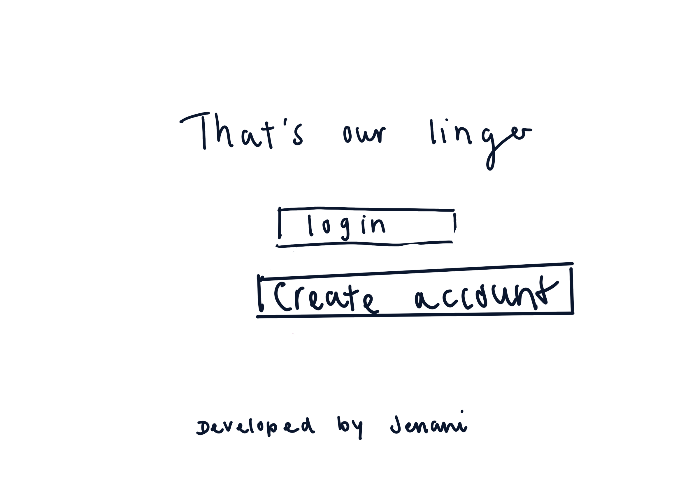
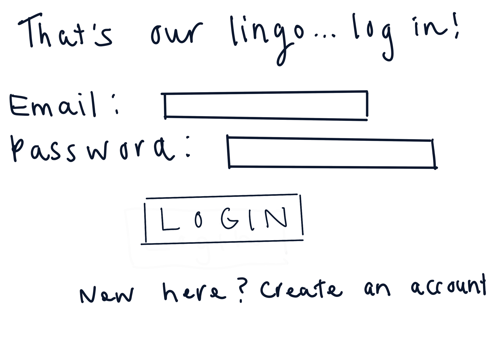
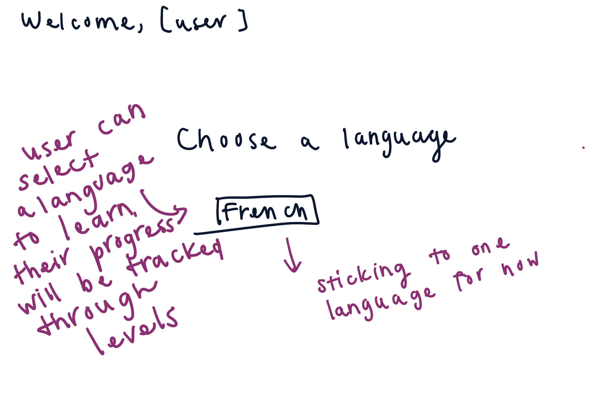
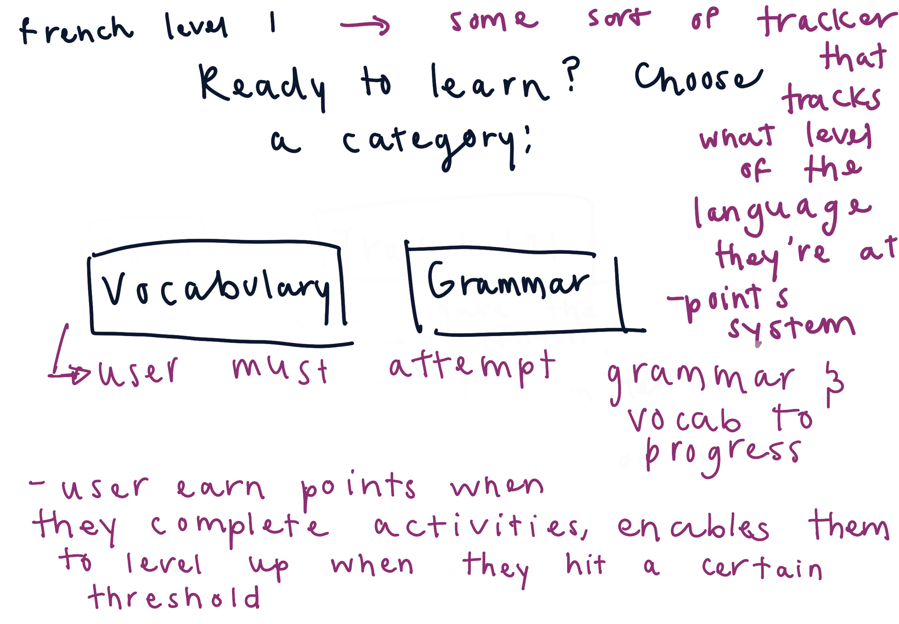
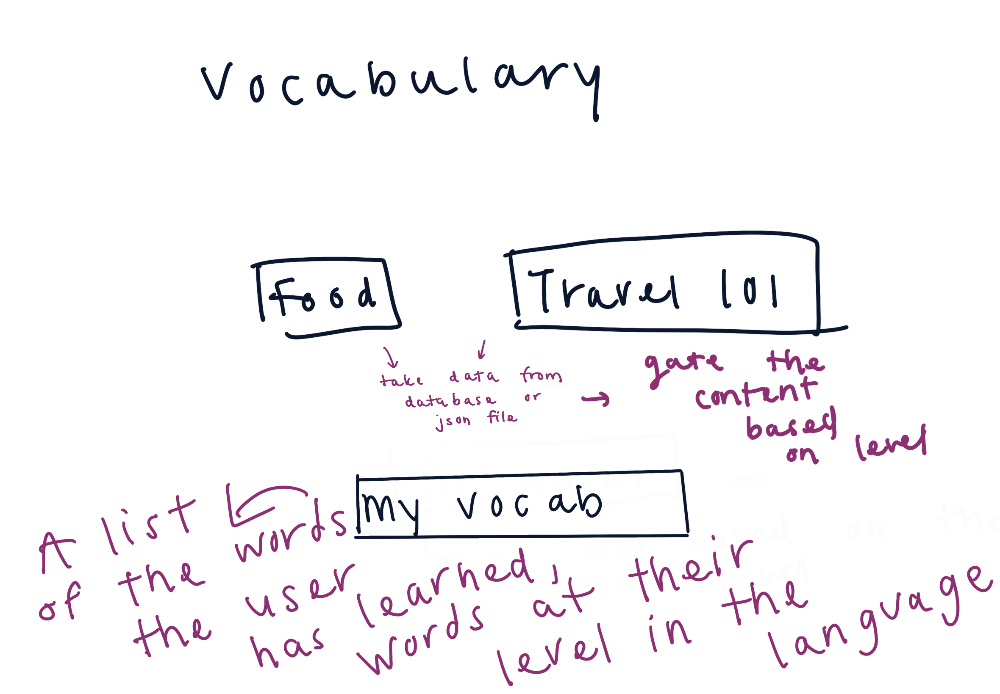
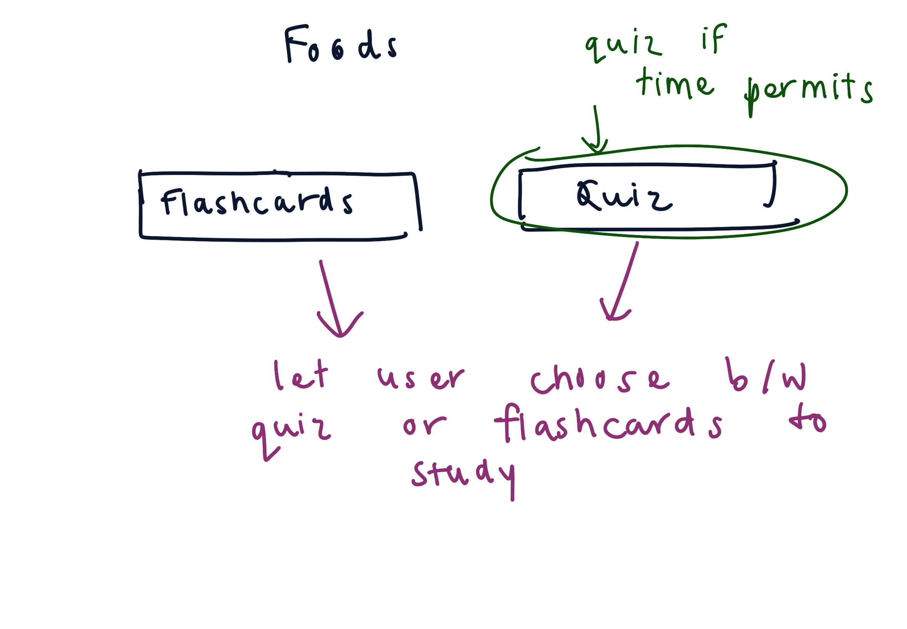
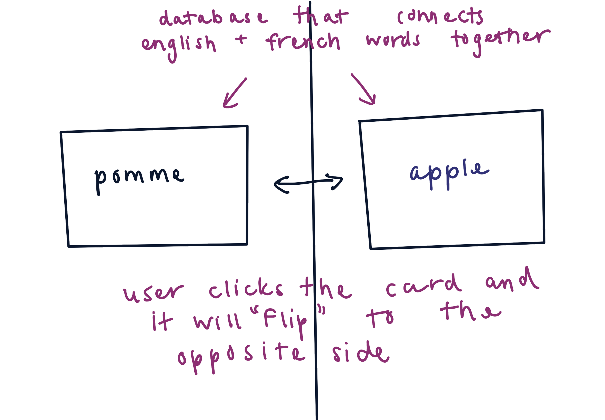
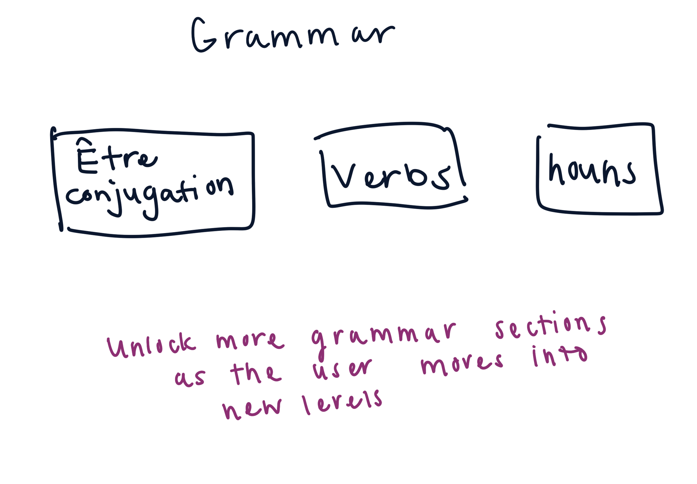
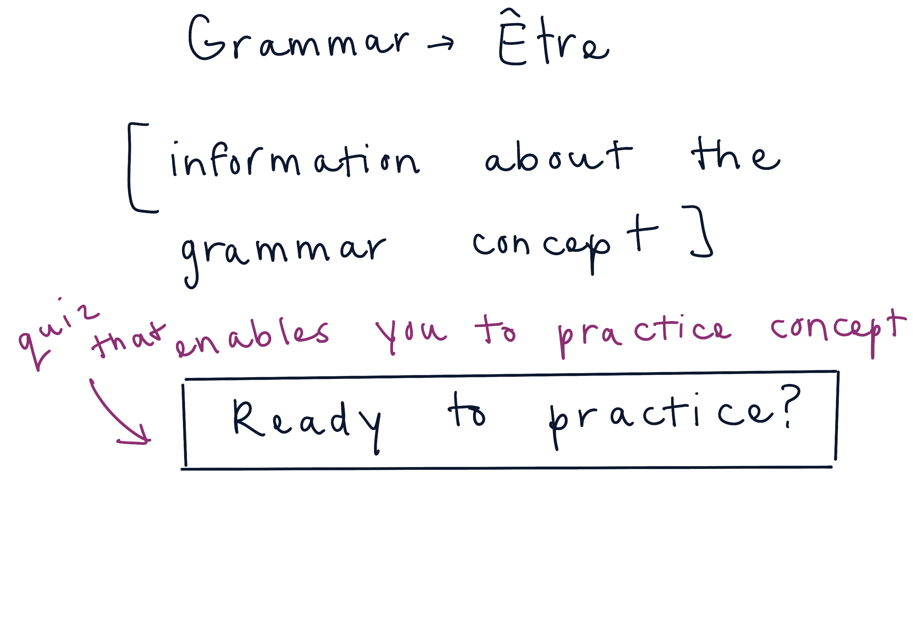
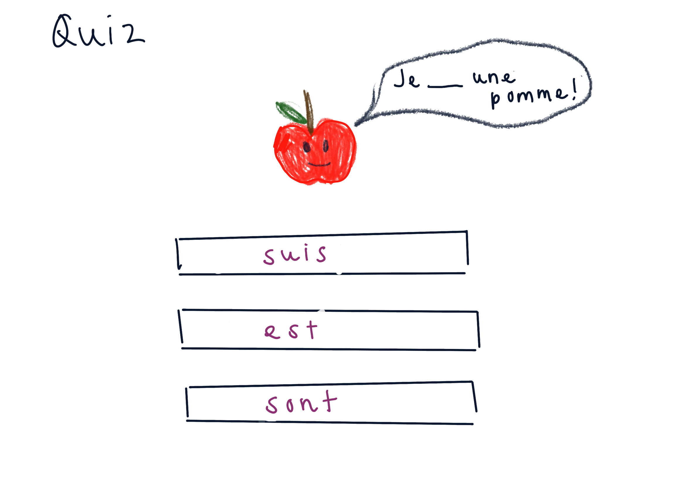

# Project Title
That's Our Lingo

## Overview

That's Our Lingo is a language learning app that makes language learning fun while ensuring your understanding of a language.

### Problem

There are many language learning apps out there, but they either focus on pure memorization or have too may paywalls that can hinder the language learning experience. Having an language learning platform that enables a learner to memorize what's needed while also gaining a strong understanding of the concepts they're learning would enhance their language learning experience. 

### User Profile

- Language learners:
    - looking for an application that can enable users to practice the memorization aspects of language learning (i.e. vocabulary), while gaining a deeper understanding of the language through learning grammar and how to apply acquired vocabulary

### Features

- As a user, I want to be able to create an account to manage my language learning progress
- As a user, I want to be able to login to manage my language learning process

- As a logged in user, I want to be able to track my progress of my language learning, and see what I've learned so far
- As a logged in user, I want to be able to be able to practice commonly used vocabulary words in my target language
- As a logged in user, I want to be able to learn important grammar rules/principles in my target language
- As a logged in user, I want to be able to test my understanding of certain grammar concepts and vocabulary 


## Implementation

### Tech Stack

- React
- MySQL
- Express
- Client libraries: 
    - react
    - react-router
    - axios
- Server libraries:
    - knex
    - express

### APIs

- No external APIs will be used for the first sprint

### Sitemap

- Home page
- Choose Language
- Choose Grammer or Vocabulary
- Choose Vocabulary Theme
- Vocabulary flashcards activity
- Choose Grammar Concept
- Grammar Concept explanation page
- Grammar Concept Quiz


### Mockups

#### Home Page


#### Register Page


#### Login Page


#### Choose Language


#### Choose Grammar or Vocabulary


#### Choose Vocabulary Category


#### Choose Flashcards or Quiz


#### Flashcards


#### Grammar Concept Selection


#### Grammar Concept Details


#### Grammar Quiz


### Data


### Endpoints

**GET /vocabulary/:languageFromParams**
- get the vocabulary words for specific language for flashcards

Parameters:
- language: Language that the user selects in the Choose Language page

Reponse:
```
[
  {
    "id": 1,
    "vocab_category": "Food",
    "language": "French",
    "level": 1
  },
  {
    "id": 2,
    "vocab_category": "Travel 101",
    "language": "French",
    "level": 1
  },
  {
    "id": 3,
    "vocab_category": "Hello & Goodbye",
    "language": "French",
    "level": 1
  },
]
```

**GET /vocabulary/:languageFromParams/:id**
- get the vocabulary words for specific category for flashcards

Parameters:
- id: Category that the user selects in the vocabulary page
- language: Language that the user selects in the Choose Language page

Reponse:
```
[
  {
    "id": 1,
    "vocab_word": "la pomme",
    "translation": "apple",
    "category_id": 1
  },
  {
    "id": 2,
    "vocab_word": "l'ananas'",
    "translation": "pineapple",
    "category_id": 1
  },
]
```

**GET /grammar/:languageFromparams**
- get the grammar content for a specific language

Parameters:
- language: Language user selects

Reponse:
```
[ {
    "id": 1 
    "grammar_concept": "masculine and feminine nouns",
    "language": "French", 
    "concept_text": "include content here"
} ]
```

**GET /grammar/:language/quiz/:level**
- get the quiz questions for the user's language and current level

Response:
```
[ {
    "id": 1,
    "question": "Fill in the blank!",
    "image": "images/grammar-3-img-7.png",
    "options": "[\"ai\",\"sommes\",\"suis\",\"sont\"]",
    "correct_answer": "suis",
    "grammar_id": 1
  }, ]
```


**POST /users/register - Not yet implemented**

- Registers a user

Parameters:

- email: User's email
- password: User's provided password

Response:
```
{
    "token": "seyJhbGciOiJIUzI1NiIsInR5cCI6IkpXVCJ9.eyJzdWIiOiIxMjM0NTY3ODkwIiwibmFtZSI6I..."
}
```

**POST /users/login**

- Login a user

Parameters:
- email: User's email
- password: User's provided password

Response:
```
{
    "token": "seyJhbGciOiJIUzI1NiIsInR5cCI6IkpXVCJ9.eyJzdWIiOiIxMjM0NTY3ODkwIiwibmFtZSI6I..."
}
```

### Auth

- JWT auth
    - Before adding auth, all API requests will be using a fake user with id 1
    - Added after core features have first been implemented
    - Store JWT in localStorage, remove when a user logs out
    - Add states for logged in showing different UI in places listed in mockups

## Roadmap

- Create client
    - react project with routes and boilerplate pages

- Create server
    - express project with routing, with placeholder vocabulary, grammar concepts, and quiz questions

- Create migrations

- Gather 5 categories with 10 vocabulary words

- Gather 3 grammar concepts 

- Create 5 quiz questions for each grammar concept

- Create seeds with sample category, vocabulary, grammar, and quiz concepts

- Deploy client and server projects so all commits will be reflected in production

- Feature: Flash card activity for vocabulary words
    - Implement flashcards based on vocabulary category
    - Create GET /vocabulary/:id endpoint

- Feature: Grammar concept content
    - Implement abiity to select to learn about a specific grammar concept, and present user with information about the concept
    - Create GET /grammar

- Feature: Grammar quiz
    - Implement quiz for each grammar concept with a points system
    - Create GET /grammar/quiz/:id**

- Feature: Home page

- Feature: Create account
    - Implement register page + form
    - Create POST /users/register endpoint

- Feature: Login
    - Implement login page + form
    - Create POST /users/login endpoint

- Feature: Implement JWT tokens
    - Server: Update expected requests / responses on protected endpoints
    - Client: Store JWT in local storage, include JWT on axios calls

- Bug fixes

- DEMO DAY

## Changes from Proposal to Final
- Removed requirement to attempt vocabulary and grammar concept before taking the 
test, in order to give users the autonomy to complete their language learning the way they want
- Removed vocabulary list component, as it seems redudant with the flashcard feature. May implement in the future if interest is there. 

## Nice-to-haves

- Quiz feature for the vocabulary page
- Comments section within each grammar concept to enable users to ask questions and seek clarification on concepts
- Test on the main language page that enables the user to test their grammar and vocabulary knowledge at once 
- Level locked content, as the user progresses through their learning journey, more concepts will be unlocked for them to learn